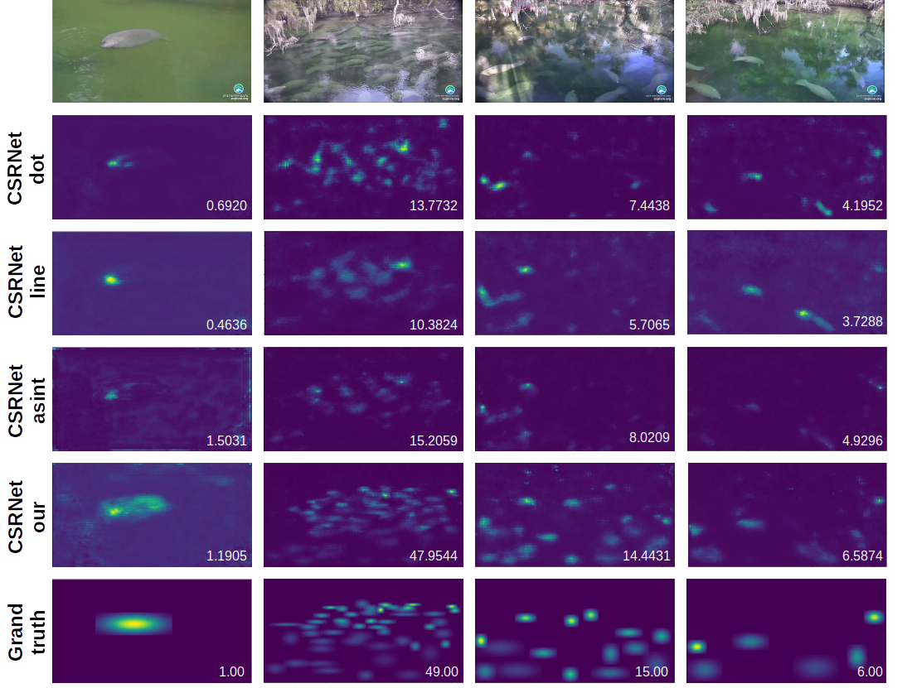

# Manatee count repo
This repo contains the code to train and test a CSRNet model for the manatee count task.
<br>
<br>
<!-- TABLE OF CONTENTS -->
  ### Table of contents
  <ol>
    <li>
      <a href="#density-map-results">Density map results</a>
    </li>
    <li>
      <a href="#getting-started">Getting Started</a>
      <ul>
        <li><a href="#pretraining-phase">Pretraining phase</a></li>
        <li><a href="#finetuning-phase">Finetuning phase</a></li>
      </ul>
    </li>
    <li><a href="#test">Test</a></li>
    <li><a href="#license">License</a></li>
    <li><a href="#contacts">Contacts</a></li>
    <li><a href="#acknowledgments">Acknowledgments</a></li>
  </ol>
  
<br>
<br>

## Density map results
The density maps predicted by our model compared with previews state-of-the-art models and the grand truths



<br>
<br>

## Getting Started

First of all clone the repo:
```sh
  git clone "url repo"
  cd Manatee_count
  ```
<br>
Then download the manatee_dataset from the [Link](https://drive.google.com/drive/folders/1rct4zK_7jNQDNe8XiIlTK4sSG9fto7Vo?usp=sharing) and the Africa WildLife dataset from [Link](https://drive.google.com/drive/folders/1VdaFXwavdHwpt71dHpjhCAxJ2vi3gDlk?usp=sharing) (if you want our random choice, otherwise from [Official Link](https://www.kaggle.com/datasets/biancaferreira/african-wildlife/data)).
<br>
More in specific, replace the "images" and the "json" folder inside the "AfricaWildlife_pretrain_code", with the "images" and "json" folder downloaded from the Africa WildLife dataset link, and the "images" and the "jsons" here, with the "images" and "jsons" folder downloaded from the manatee_dataset link.

### Pretraining phase

To run the pretraining phase, first you have tu build the dataset (creating the density maps) and then to start the train. So, run:
```sh
  cd AfricaWildlife_pretrain_code
  python3 my_dataset_creation.py
  python3 my_train_CSRNet.py
  ```
<br>
<br>

### Finetuning phase
To run the finetuning phase, move the pretraining weights inside the "pretrain" folder or download them from [Here](https://drive.google.com/drive/folders/1QK8jkOtCrRkQqVzSdhlEG9ikNWxL36rK?usp=sharing) [NB: Name the: "CSRNet_AfricaWildlife_final.pth"].
Then run:
```sh
  python3 my_dataset_creation.py
  python3 augment_dataset.py (#only if you want to augment the dataset)
  python3 my_train_CSRNet.py
  ```

<br>
<br>

## Test
To test the model trained, put the best weights inside the "model_to_test" calling them "best.pth". If you want just test the pretrained model, download the weights from [Here](https://drive.google.com/drive/folders/1QK8jkOtCrRkQqVzSdhlEG9ikNWxL36rK?usp=sharing) and put them inside "model_to_test". After run:
```sh
  python3 test.py (#to test the model)
  python3 save_test.py (#if you want also to save the results)
  ```

<br>
<br>

## License
This repository can only be used for personal/research/non-commercial purposes. However, for commercial requests, please contact us directly <a href="#contacts">contacts</a>
  
<br>
<br>

## Contacts
Matteo Zaramella - zaramella.2025806@studenti.uniroma1.it or matteozara98@gmail.com

Xingquan (Hill) Zhu - xzhu3@fau.edu

Irene Amerini - amerini@diag.uniroma1.it

<br>
<br>

## Acknowledgments

The code for this repo is based on the previews project proposed by Wang et al. [Git repository](https://github.com/yeyimilk/deep-learning-for-manatee-counting). We thank the authors for releasing their code and models.


